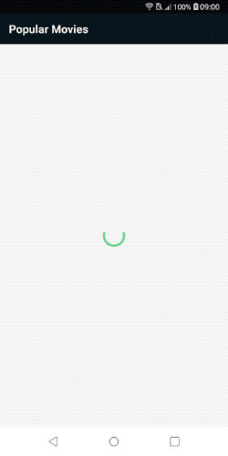
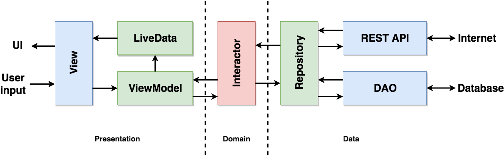

[](https://kotlinlang.org)
[](https://android-arsenal.com/api?level=21)
[](https://ktlint.github.io/)

# Popular Movie List Sample App

## Project description



### About
I created this project to show a sample of my coding and architecture skills. It is a playground of using [Android Jetpack Components](https://developer.android.com/jetpack) and my implementation of [Clean Architecture](https://blog.cleancoder.com/uncle-bob/2012/08/13/the-clean-architecture.html) Principles.

### Functionality

This app is based on [The Movie Database API](https://www.themoviedb.org/documentation/api). 

The main use-cases are showing **a list of popular movies** and showing **a movie detail**. 

**The list of movies** loads more items when a user reaches the bottom of the list. **The movie detail** contains a list of similar movies and also reviews.

The app handles **different states** such as **Progress**, **Empty** and **Error**.  

The app is **online-first**, but there are some limited **offline capabilities**. The app saves the first page of loaded data to **the database**. Also, it saves every opened movie detail to the database too. This not enough for full offline work, but it allows the user to open movie details that have already opened before. All the loaded data are also **cached**.

## Loading delay

The Gradle config contains the `USE_LOADING_DELAY` field. You can set it to true to enable **3 seconds delay** for all API calls. It won't apply to read from the cache, so cache calls would be fast as normal. This option allows you to check how the app handles different states of loading. 

Thanks to Kotlin **coroutines**, heavy operations are performed in parallel and completed at the same time.


## Tech-stack
The project is written in **Kotlin**. The minimal Android **API level is 21**

### Libraries
* [Kotlin Coroutines](https://kotlinlang.org/docs/reference/coroutines-overview.html) - perform async operations.
* [AndroidX](https://developer.android.com/jetpack/androidx) - AndroidX is a major improvement to the original Android Support Library, which is no longer maintained.
* [Material](https://material.io/develop/android/docs/getting-started/) - Material Design themes.
* [Room](https://developer.android.com/topic/libraries/architecture/room) - an abstraction layer over the SQLite database.
* [Retrofit2](https://square.github.io/retrofit/) - a HTTP client.
* [Moshi](https://github.com/square/moshi) - parsing JSON.
* [ViewModel](https://developer.android.com/topic/libraries/architecture/viewmodel) and [LiveData](https://developer.android.com/topic/libraries/architecture/livedata) from [Android Jetpack](https://developer.android.com/jetpack) - the realization of MVVM architecture.
* [Coil](https://github.com/coil-kt/coil) - an image loading library for Android backed by Kotlin Coroutines.
* [Koin](https://github.com/InsertKoinIO/koin) - a dependency injection framework for Kotlin.

### Testing

The app has **unit tests** for all **Presentation**, **Domain** and **Data** layers, with [JUnit](https://developer.android.com/training/testing/unit-testing/local-unit-tests) + [Mockito](https://github.com/mockito/mockito) + [Mockito Kotlin](https://github.com/nhaarman/mockito-kotlin) libraries.

* **Presentation.** Test LiveData observers updated by ViewModels. The view contains only methods for displaying UI and doesn't contain any logic. So we can test how data and states are changed by ViewModel without the need to test UI classes.  
* **Domain.** Test how do Interactors organize data received from Repositories.
* **Data.** Test loading data from all sources such as the Internet, Database or Cache.


### Data persistence
The application loads data in this priority:

`Cache` -> `Internet` -> `Database`

If the required data available in the **runtime cache**, the app will use it, instead of making a new API call even if an internet connection is available.  It is a good approach for mobile devices because of the instability of the mobile internet.

If the data aren't cached, the app will try to **load data from the internet**. Also, save received data to the database and the cache.

If the internet call fails, try to return **data saved to the database**.

##Architecture
The app is implemented in compliance with the [Clean Architecture](https://blog.cleancoder.com/uncle-bob/2012/08/13/the-clean-architecture.html) principles.
**MVVM** architecture is used for the presentation layer.

<p align="center">
  
</p>

### Presentation layer
Fragments, Activities and other classes responsible for UI.

* **View.** A Fragment instance that doesn't contain any states, data and has no logic, except displaying UI. Informing the ViewModel about user interactions, displaying data and states received from ViewModel.
* **ViewModel.** A class containing all data and states of View. The ViewModel retains while View is recreating. It doesn't contain any Android SDK code. Loads data using the Interactor. Manage the View with changing a LiveData value.  
* **LiveData.** Notify the View when data or state stored in the ViewModel changes.

### Domain layer
* **Interactor.** A class combining data loaded from different Repositories so that the ViewModel has a single data source.

### Data layer
* **Repository.** A class loading data from different sources such as the Internet, Database or Cache.
* **REST API.** A Retrofit interface helping with HTTP calls.
* **DAO and Database.** A Room database and DAO classes operating with it.


## License

```
Copyright 2019 Google, Inc.

Licensed to the Apache Software Foundation (ASF) under one or more contributor
license agreements. See the NOTICE file distributed with this work for
additional information regarding copyright ownership. The ASF licenses this
file to you under the Apache License, Version 2.0 (the "License"); you may not
use this file except in compliance with the License. You may obtain a copy of
the License at

http://www.apache.org/licenses/LICENSE-2.0

Unless required by applicable law or agreed to in writing, software
distributed under the License is distributed on an "AS IS" BASIS, WITHOUT
WARRANTIES OR CONDITIONS OF ANY KIND, either express or implied. See the
License for the specific language governing permissions and limitations under
the License.
```


